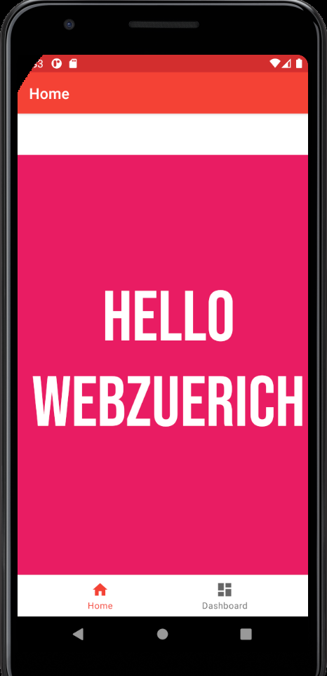

<div align="center">

# Web Zürich Design Tokens Demo

This repo is to showcase Design Tokens using [Style Dictionary](https://amzn.github.io/style-dictionary/#/) by integrating it into an Android Application (Kotlin) and React (JavaScript)




</div>

## Prerequisites

- [Android Studio](https://developer.android.com/studio)
- [Node >=12](https://nodejs.org/en/)
- [Yarn](https://yarnpkg.com/)

## Getting Started

1. Install the dependencies:

```bash
git clone git@github.com:BrunnerLivio/webzuerich-design-tokens-demo.git
yarn
```

2. Run in development mode

```bash
yarn start
```

3. Build

```bash
yarn build
```
